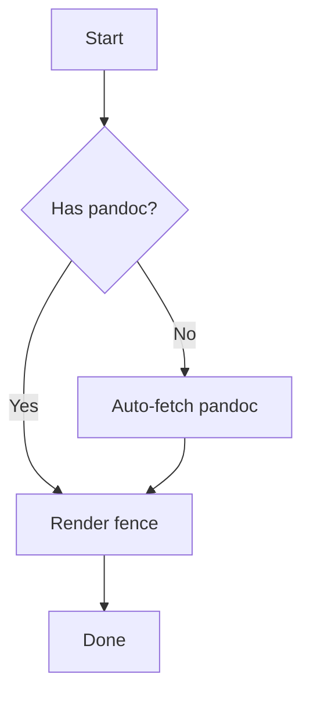
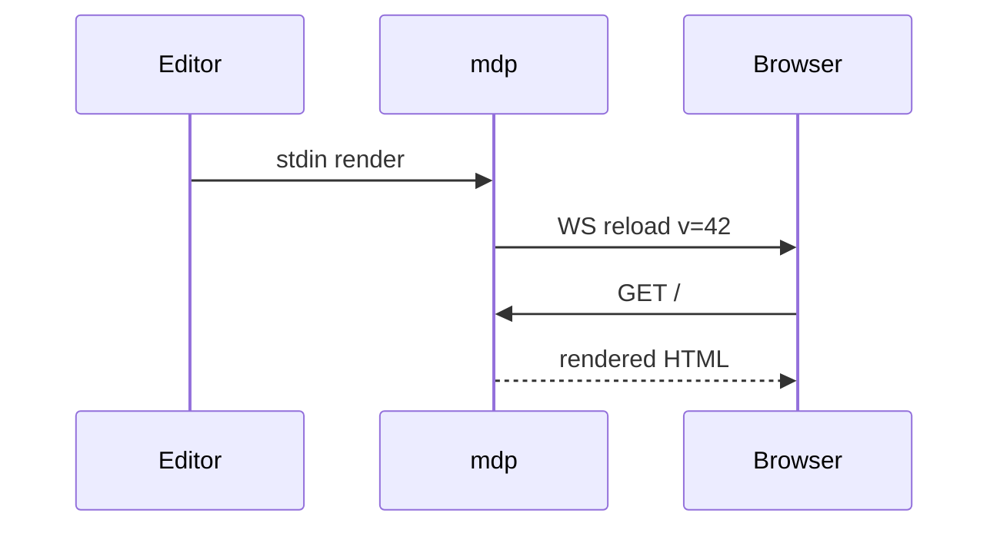
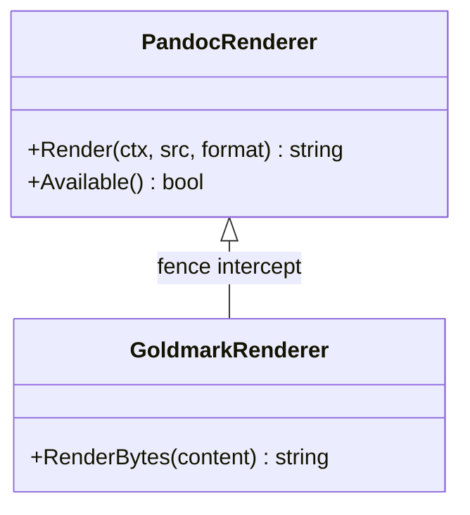

# Markdown with embedded Mermaid diagrams

Mdp recognizes ` ```mermaid ` fences and emits a `<pre class="mermaid">`
wrapping the raw source. The embedded mermaid.js bundle (loaded
conditionally, only when a mermaid fence is present) auto-runs on
page load and replaces each block with an inline SVG.

## Flowchart



## Sequence diagram



## Class diagram



Prose after the diagrams continues normally.
